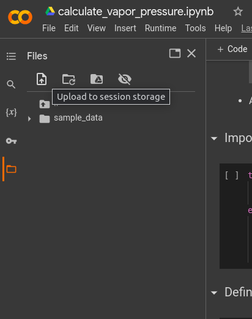
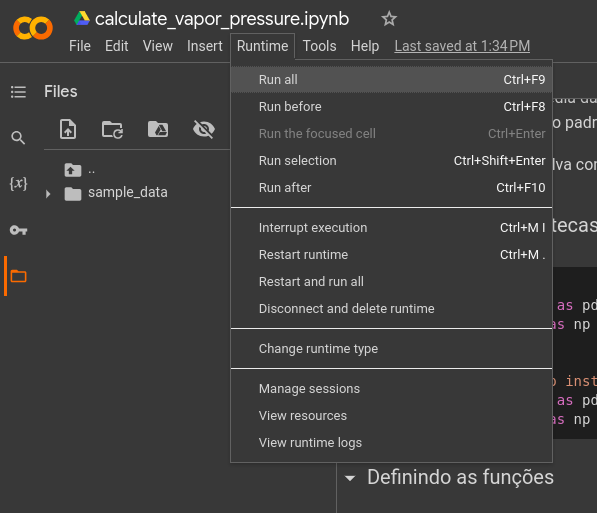

[⬅ Voltar](../README.md)

# Calculando

O artigo do grupo do professor Stefan Grimme nos mostra que a pressão de vapor de um composto pode ser calculada com a equação de Ben-Naimm.  

```math
\begin{equation} P=\frac{R\times T\times \rho_{liq}}{MW}\times exp\left(\frac{1}{R\times T}\times(\overline{G^*}_{liq}-\overline{G^*}_{vap})\right) \end{equation} 

```

Onde:

| Variável | Descrição | Unidade |
| --- | --- | --- |
| P | pressão de vapor | Pascal (PA) |
| R | constante dos gases | J/(mol*K) |
| T | temperatura | K |
| p_liq | densidade do líquido | kg/m^3 |
| MW | massa molar | kg/mol |
| G_liq | energia livre da fase líquida obtida com o CENSO | J/mol |
| G_vap | energia livre da fase vapor obtida com o CENSO | J/mol |

O CENSO nos retorna as os valores de `G_vap` e `G_liq` em Hartree, e precisam ser convertidos para `J/mol` para serem usados na equação de Ben-Naimm.

Esse repositório possui um arquivo no formato `.ipynb`, que consegue calcular a partir de um arquivo de entrada no formato `.csv` (basicamente é uma planilha), a pressão de vários compostos de forma automatizada.

Como você pode não ter facilidade com a linguagem de programação Python, instalação de pacotes com o pip, uso do jupyter notebook, entre outras coisas, vou mostrar uma boa alternativa para rodar esse script no navegador, sem precisar instalar nada.

A ferramenta é o [Google Colab](https://colab.research.google.com/), e ele permite que qualquer pessoa execute códigos Python a partir do navegador.

Para executar esse script no Google Colab, primeiro faça o preenchimento do arquivo `values.csv` com os dados necessários para o cálculo.

Depois acesse a página inicial do [Google Colab](https://colab.research.google.com/), e selecione a opção `Upload`, e selecione o arquivo calculate_vapor_pressure.ipynb.


Depois, na barra lateral, clique no ícone `Files` e faça o upload do arquivo `values.csv`.



E por último, execute cada célula do programa individualmente, ou execute todas, clicando em `Runtime` e depois em `Run All`.



O programa irá realizar o cálculo das pressões de vapor, log na base 10, e também a média e desvio padrão dos valores com o mesmo nome na coluna `Molécula`, e os resultados serão salvos em arquivos no formato `.csv`, e também serão impressos na tela.
Ao imprimir os valores na tela, os valores podem estar arredondados, nos arquivos salvos os valores estarão com todas as casas decimais.